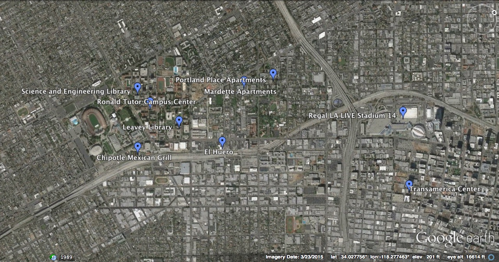
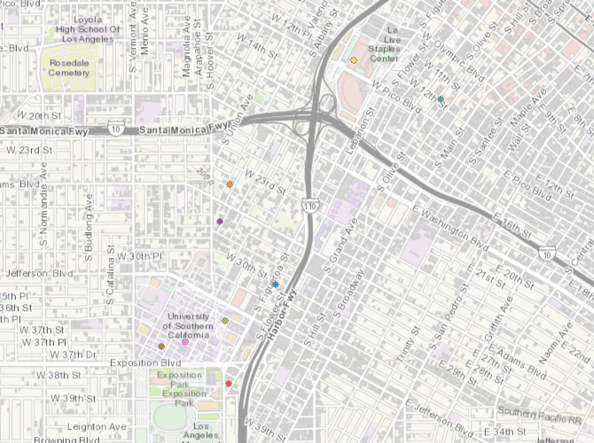
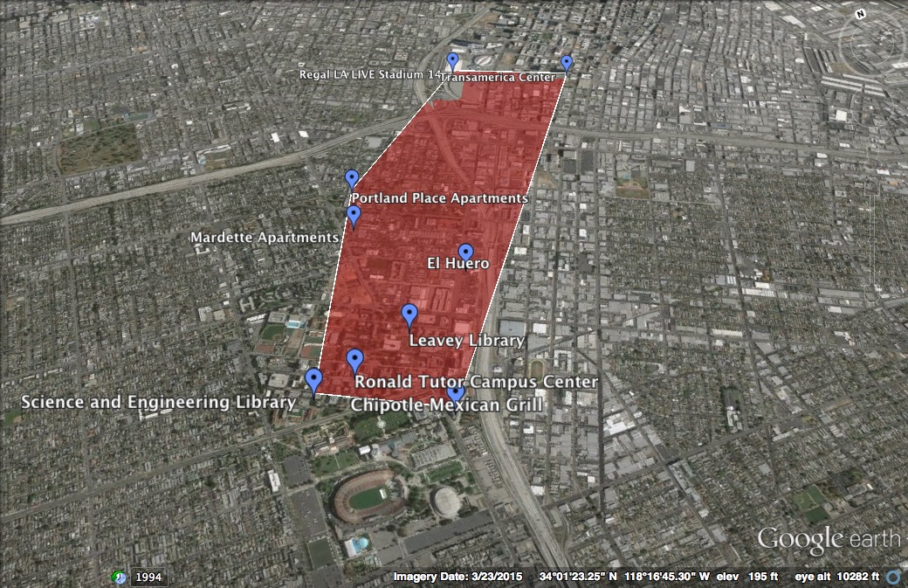
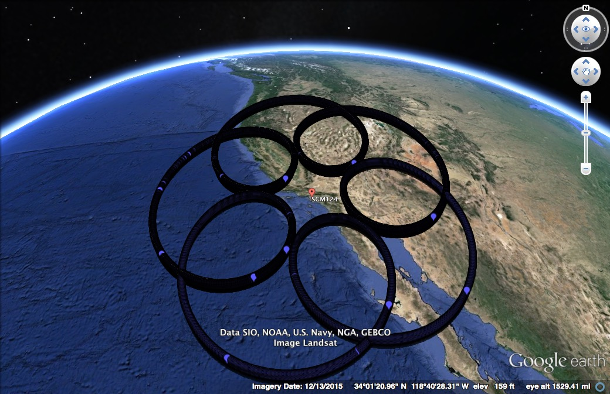

# Spatial-Data
I had never worked with Spatial Data before, so these are my findings on experimenting with the same, for the first time.
## Obtaining Points of Interest
To begin with, I took 9 locations that I frequently visit and I got their lat, long values and created a [KML](my_places.kml) file with the same. [KML](https://developers.google.com/kml/) is a file format used to display geographic data in an Earth browser such as Google Earth. I got the exact latitutes, and longitudes from http://www.latlong.net/.

## Visualizing the KML File using Google Earth
Once the KML file was ready, I could visualize the same on [Google Earth](https://www.google.com/earth/). Unfortunately Google Earth website doesn't support uploading KML files, but the applications for Windows and MAC do. I downloaded the Google Earth for MAC and I was able to see my points on the same. This is how they looked.


## Creating Shape Files and visualising on ArcExplorer
I downloaded [Quantum GIS (QGIS)](http://www.qgis.org/en/site/) to convert the KML file to [shape files](Shapes.zip). I then used the .shp file to visualize the points on ArcGIS Explorer. I used the [Online ArcGIS Viewer](http://www.arcgis.com/home/webmap/viewer.html?useExisting=1), in which you can simply upload the zip file and it will show the points on the ArcGIS map. The visualization looked as follows:


## Adding the geo points in DB and querying
I used the Postgres+PostGIS to run spatial query on the data. The queries to create and insert the data are given in the [Queries.sql](Queries.sql). After the data was inserted in the DB, there were 2 major queries that I ran. One was for the [convex hull](http://mathworld.wolfram.com/ConvexHull.html). This was to create a convex hull of my points of interest. I used the [ST_ConvexHull](http://postgis.org/docs/ST_ConvexHull.html) to get the convex hull. I added the convex hull points in my orginal KML file to visulize it on Google Earth and it looked as follows:


The other query that I ran was regarding the 3 nearest neighbours to a point of interest. I queried this using the [<->](http://postgis.net/docs/geometry_distance_centroid.html) operator. This returns the 2D distance between the centroids of the bounding boxes of two geometries. The neighbours then again were added to the KML file to visualize on Google Earth.


## Spirograph
Finally, I wrote a [python script](generate_spirograph_kml.py) to find the points around a point in the form of a [Spirograph](https://www.google.com/search?q=Spirograph+curve&ie=utf-8&oe=utf-8). I used the following formula for Spirograph points:
```
x(t) = (R+r)*cos((r/R)*t) - a*cos((1+r/R)*t)
y(t) = (R+r)*sin((r/R)*t) - a*sin((1+r/R)*t)
```
with
`R=5, r=1 and a=4`
The result of running the [generate_spirograph_kml.py](generate_spirograph_kml.py) was [spiro.kml](spiro.kml), which when visualised on Google Earth looked as follows:

